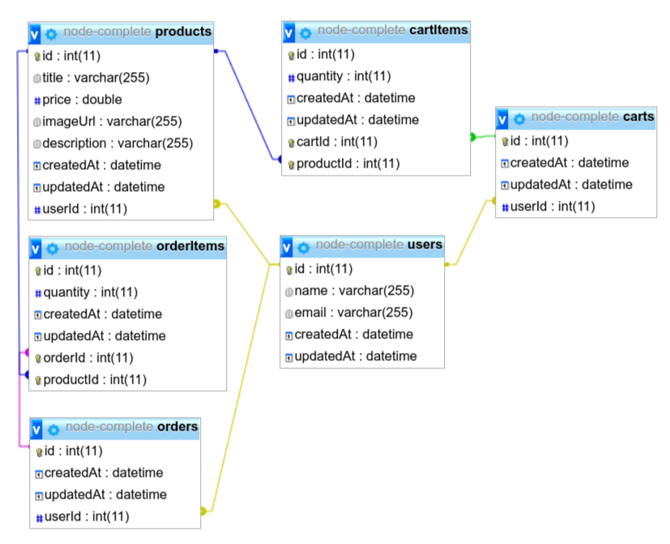

# nodejs-guide

A simple project to practice working with nodejs.

The project does not use databases. Uses data storage in local files `data/products.json` and  `data/cart.json`

## Install
* Install all packages  `npm i`

## Available Scripts
In the project directory, you can run:
* `npm run start` start project in development mode
* `npm run start-server` start project in production mode 

Runs the app in the development mode. Open http://localhost:3000 to view it in the browser.

## Built With
* [body-parser](https://github.com/expressjs/body-parser) - Parse incoming request bodies in a middleware before your handlers, available under the req.body property.
* [ejs](https://github.com/mde/ejs) - html template engine
* [express](https://expressjs.com/ru/) - minimal and flexible Node.js web application framework
* [nodemon](https://nodemon.io/) - monitor for any changes in your source and automatically restart your server
* [sequelize](https://github.com/sequelize/sequelize) - is a promise-based Node.js ORM for MySQL

