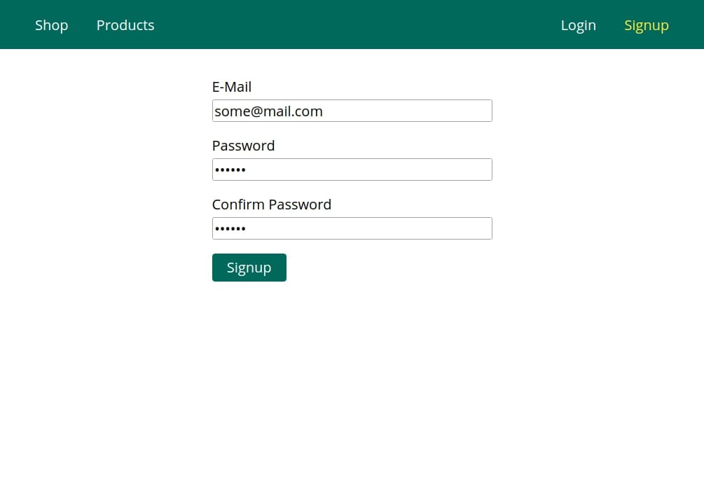
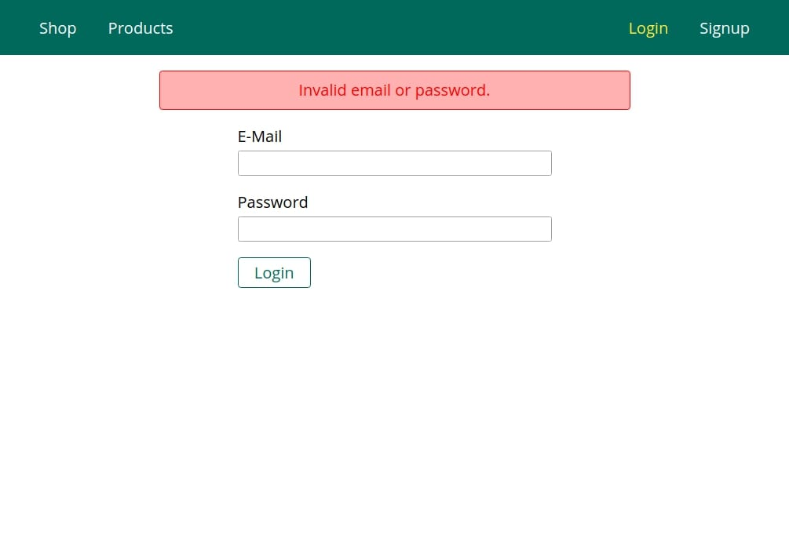
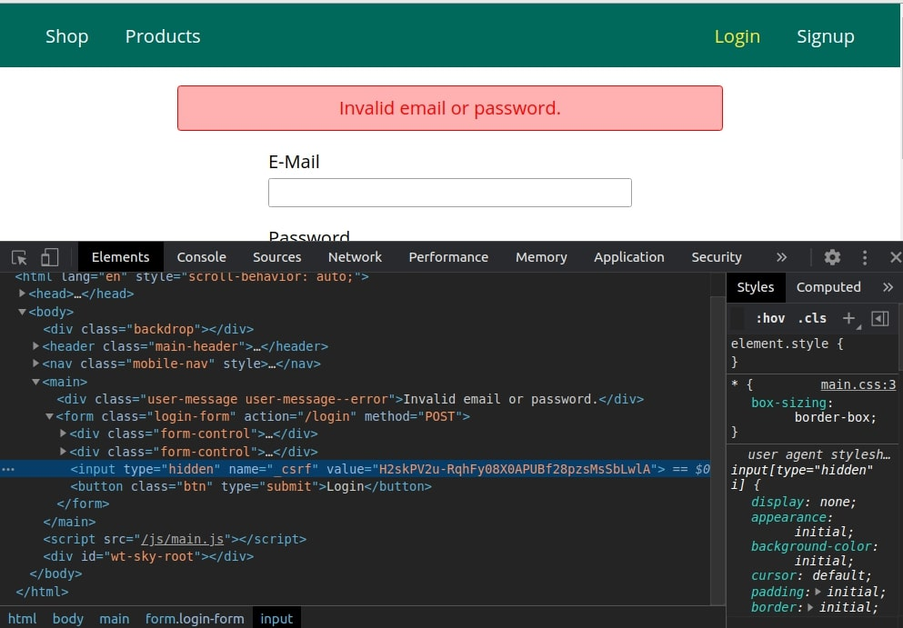

# nodejs-guide

A simple project to practice working with nodejs.

The project use mongodb databases.
Saves user data in server-side session to mongodb database.
Hides menu items for unauthorized users. 
We store all user data in sessions.
Encrypts the password before saving to the database.
Uses tokens to protect data submission forms.
Displays error messages to the user on the page.

## Install
* Install all packages  `npm i`
* Create table `shop` in mongodb before starting
* Save connect settings in `app.js`

## Available Scripts
In the project directory, you can run:
* `npm run start` start project in development mode
* `npm run start-server` start project in production mode

Runs the app in the development mode. Open http://localhost:3000 to view it in the browser.

## Built With
* [bcryptjs](https://github.com/dcodeIO/bcrypt.js) - is a secured way to store passwords in my database regardless of whatever language my app’s backend
* [body-parser](https://github.com/expressjs/body-parser) - Parse incoming request bodies in a middleware before your handlers, available under the req.body property.
* [connect-flash](https://github.com/jaredhanson/connect-flash) - is a special area of the session used for storing messages.
* [connect-mongodb-session](https://github.com/mongodb-js/connect-mongodb-session) - MongoDB-backed session storage for connect and Express. Used to store sessions in MongoDB.
* [csurf](https://github.com/expressjs/csurf) - is a middleware for CSRF token creation and validation.
* [ejs](https://github.com/mde/ejs) - html template engine
* [express](https://expressjs.com/ru/) - minimal and flexible Node.js web application framework
* [express-session](https://github.com/expressjs/session) - The data is stored on the server, and the client-side session ID is in a cookie. Moreover, `express-session` uses the `cookie-parser` by default to parse `cookies`.
* [nodemon](https://nodemon.io/) - monitor for any changes in your source and automatically restart your server
* [mongoose](https://mongoosejs.com/) -  is a MongoDB object modeling tool designed to work in an asynchronous environment. Mongoose supports both promises and callbacks.

